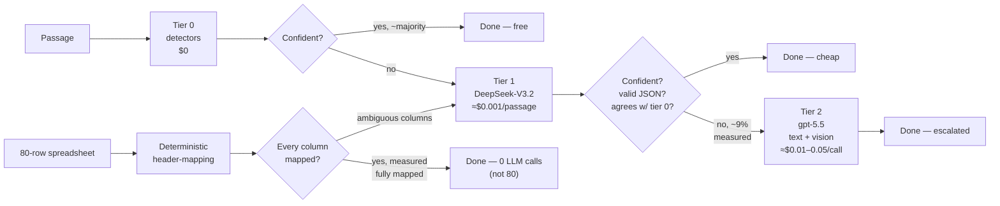

# Breach Analytics at Scale — Architecture Diagram

## System architecture: the deterministic pipeline and the agent layer

```mermaid
flowchart TB
    subgraph Ingest["INGEST"]
        A1[Raw corpus: PDF, DOCX,\nXLSX/CSV, EML+attachments,\nHTML, TXT, PNG] --> A2[Inventory + sha256 dedup]
        A2 --> A3{MIME sniff\nmatches extension?}
        A3 -->|no / unreadable| A4[(Quarantine\n+ reason code)]
        A3 -->|yes| A5[Classify + route]
    end

    subgraph Parse["PARSE"]
        A5 --> B1[Per-type parser]
        B1 --> B2{Image-based\npage?}
        B2 -->|yes| B3[OCR]
        B2 -->|no| B4[Direct text]
        B3 --> B5[Passages\nchar-offset anchored]
        B4 --> B5
        B1 -->|email attachment| A2
    end

    subgraph Extract["TIERED EXTRACTION"]
        B5 --> C1[Tier 0: deterministic\ndetectors — regex + checksums\nFREE]
        C1 --> C2{Confidence\nsufficient?}
        C2 -->|yes| C5[mentions +\npii_elements]
        C2 -->|no| C3[Tier 1: DeepSeek-V3.2\ncheap bulk extraction]
        C3 --> C4{Escalate?\ninvalid JSON /\nlow confidence /\ntier0 disagreement}
        C4 -->|yes| C6[Tier 2: gpt-5.5\ntext + vision]
        C4 -->|no| C5
        C6 --> C5
    end

    subgraph ER["ENTITY RESOLUTION"]
        C5 --> D1[Normalize + phonetic block]
        D1 --> D2[Weighted score\n+ hard constraints]
        D2 --> D3{Band}
        D3 -->|≥0.85| D4[Auto-link]
        D3 -->|0.40–0.85| D5[Gray zone →\nadjudicator agent]
        D3 -->|≤0.40| D6[Distinct]
        D4 --> D7[(persons +\nidentity_links)]
        D6 --> D7
    end

    subgraph Exposure["EXPOSURE"]
        D7 --> E1[Compute exposure_flags\n+ flag_evidence]
        E1 --> E2[(Exposure table)]
    end

    subgraph Agents["AGENT LAYER — beside the pipeline, budgeted + traced + gated"]
        F1[Orchestrator\nrun checkpoints]
        F2[Exception investigator\nquarantine queue]
        F3[ER adjudicator\ngray-band pairs]
        F4[QA auditor\npost-run flag sample]
    end

    A4 -.dispatches.-> F2
    F2 -.resolved route.-> A5
    D5 -.dispatches.-> F3
    F3 -.merge/no_merge/escalate.-> D7
    F3 -.bulk impact >10.-> G1{{Human\napproval gate}}
    G1 -.approved.-> D7
    E2 -.stratified sample.-> F4
    F1 -.directives.-> F2
    F1 -.directives.-> F3

    E2 --> H1[REST API /api/v1]
    H1 --> H2[React frontend\nDashboard · Exposure · Person detail\nReview queue · Agent traces]

    style A4 fill:#3a2020
    style G1 fill:#3a3020
    style Agents fill:#1a2530
```

## Cost-tiered routing — the design that makes 1M documents affordable

Real measured routing on the 520-document live run: 519 tier-1 calls, 46 tier-2 calls (37 text +
9 vision) — an 8.9% escalation rate — for a blended $0.0132/document. The spreadsheet path's
deterministic header-mapping measured `llm_calls=0` on every fully-mapped sheet during the live
run, confirming the "one call, not eighty" design holds in practice, not just in theory.
