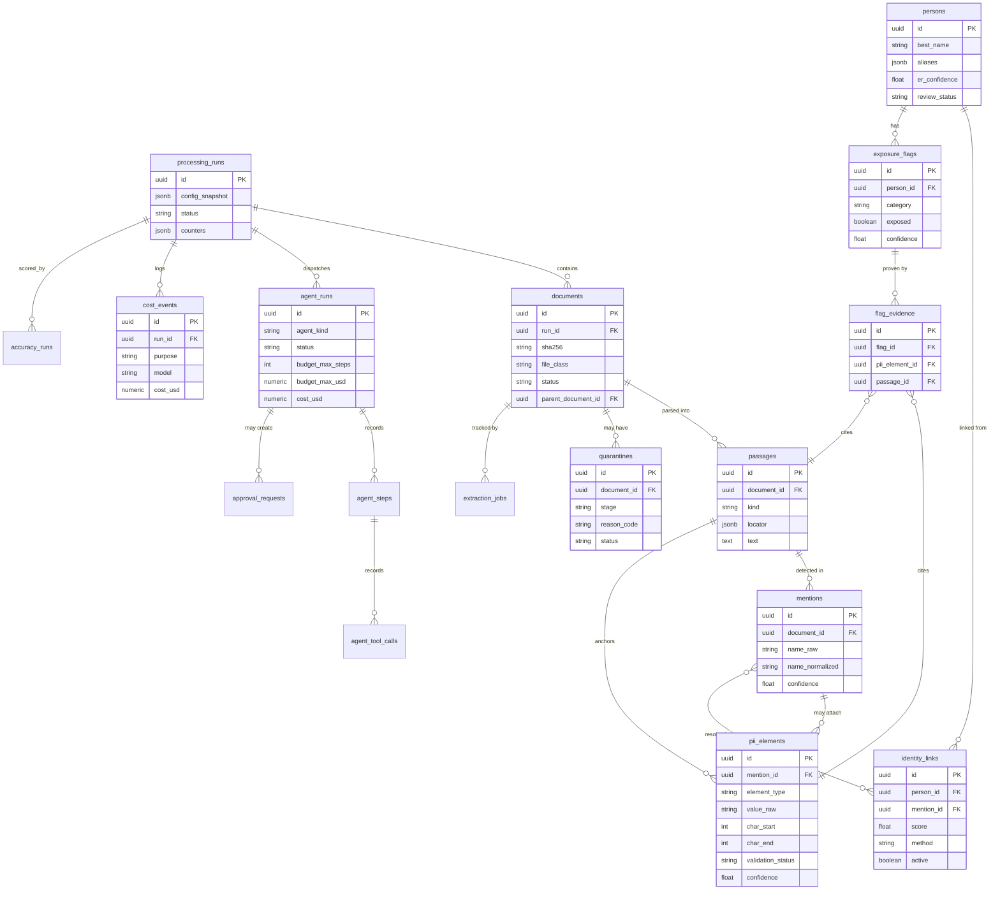

# Breach Analytics at Scale — Solution Design Document

**DataFactZ AI Engineering Internship — Use Case 3 (Capstone)**
**Author:** Yaswanth Thottempudi | **Date:** August 14, 2026

---

## 1. Architecture & Stack Justification

### 1.1 System overview

A synthetic breach corpus (520 documents, 8 file types, 160 seeded identities) is ingested,
parsed, PII-extracted through a cost-tiered pipeline, entity-resolved to unique individuals, and
rendered as an exposure table — one row per person, one boolean flag per exposed-data category,
every flag traceable to an exact source passage. A deterministic pipeline handles the bulk path;
four budgeted, fully-traced agents handle the judgment calls the pipeline cannot enumerate in
advance.

```
corpus → INGEST (inventory, sha256 dedup, MIME-sniff vs extension, classify, route|quarantine)
       → PARSE (per-type; email attachments recursively re-ingested; OCR when image-based)
       → passages (anchored text units)
       → TIER 0 detectors (regex + checksums, free)
       → TIER 1 DeepSeek-V3.2 (bulk extraction, Pydantic-validated, one bounded repair)
       → TIER 2 gpt-5.5 (text + vision) on escalation only
       → mentions + pii_elements (char-offset-anchored)
       → ENTITY RESOLUTION (normalize → block → score with hard constraints → 3 bands)
       → persons + identity_links + exposure_flags + flag_evidence
       → exposure table (UI, CSV/XLSX export)
```

Agents sit **beside** the pipeline, never inside the per-document loop. They consume queues the
pipeline produces (quarantines, gray-band entity pairs, run checkpoints, a stratified flag
sample) and emit structured decisions the deterministic system applies.

| Agent | Trigger | Budget | Output |
|---|---|---|---|
| Orchestrator | Run start/checkpoints/end | 15 steps, $1.00/checkpoint | Directives: dispatch investigator, adjust threshold, request sign-off |
| Exception investigator | Quarantine rows | 12 steps, 60K tok, $0.50/doc | Resolve (corrected route) or escalate with a structured diagnosis |
| ER adjudicator | Gray-band entity pairs | 10 steps, $0.30/pair | merge / no_merge / escalate, with feature-cited rationale |
| QA auditor | Post-run stratified flag sample | 3 steps/flag, $2.00/run | verified / contradicted, requiring the exact quoted span be re-found in the passage |

### 1.2 The pipeline-vs-agent boundary — the reasoning

**Rule:** code handles every step whose control flow can be enumerated in advance; agents handle
only steps where the next action depends on evidence that cannot be enumerated a priori — and
even then, through a constrained tool surface, within a hard budget, writing decisions the
deterministic system applies rather than acting on the system directly.

Three arguments support this split:

- **Cost.** Agents touch exceptions — a bounded, sublinearly-growing fraction of the corpus —
  never the bulk of documents. Measured live: 519 tier-1 calls and 46 tier-2 calls processed all
  527 completed documents at $0.90 combined; the four agent kinds together cost $6.06 across 24
  real dispatches, entirely on exception handling (4 quarantines, a targeted sample of gray
  pairs, one orchestrator checkpoint) — not on the 520-document bulk path.
- **Defensibility.** The pipeline is deterministic and replayable byte-for-byte from
  `documents` + `config_snapshot`. Agent decisions are the only non-deterministic inputs in the
  whole system, and each one is persisted with a full trace (every step, every tool call, every
  token and dollar) before it is allowed to take effect — individually auditable, individually
  reversible (`identity_links` is append-only; an unlink is a new inactive row, not a deletion).
- **Testability.** Detectors, parsers, and entity-resolution scoring are unit-tested directly
  against the ground-truth manifest. Agents are evaluated by the QA auditor's structural
  re-verification (does the quoted span actually appear in the passage) plus the accuracy
  harness, not by inspection.

**What a reviewer will push on:** "why isn't this one big agent?" The honest answer is cost and
defensibility, not capability — an LLM could plausibly do the whole pipeline end to end, but it
would be unaffordable at 1M documents, unreplayable, and its reasoning about ordinary documents
would be exactly as untestable as its reasoning about hard ones. Reserving agent judgment for
the fraction of documents that actually need it is what makes the system affordable and
auditable at once.

### 1.3 Stack justification (2+ rejected alternatives per decision)

**Orchestration — hand-rolled on both layers.** The bulk pipeline is an async job-runner
(status rows + a startup stale-job reaper); the agent layer is a first-party `AgentRunner`
(~200 lines) over native tool/function calling. *Rejected:* LangGraph — four agents running
linear tool loops with one decision at the end do not need graph state, and the framework would
own exactly the budget/trace/failure mechanics this system is graded on. Claude Agent SDK — a
filesystem/bash-capable harness is gratuitous attack surface inside a PII product, and its loop
would hide the budget/trace mechanics that need to be visible; it remains the dev-time tool
surface regardless (§1.5). Celery/Temporal for the bulk path — the correct answer at 100x scale
(§1.6), zero demo value at 520 documents.

**Models per tier.** Tier 0: deterministic detectors, $0. Tier 1: DeepSeek-V3.2 via Azure AI
Foundry ($0.58/$1.68 per MTok). Tier 2 and the agent layer: `gpt-5.5` via the same Azure AI
Foundry resource, Global Standard deployment ($5.00/$30.00/$0.50 input/output/cached per MTok).
*Rejected tier 1:* a second, more expensive OpenAI deployment as tier 1 (2–3x DeepSeek either
way; the brief explicitly suggests testing DeepSeek); a self-hosted open model (quality unproven
in the available window — named as the honest lever for 1M-document cost in §1.6, not built
now). *Rejected tier 2/agents:* Anthropic Claude (no Anthropic credential was ever provisioned
for this engagement — a real procurement constraint, stated plainly rather than dressed up as
pure technical preference); a three-tier OpenAI split assumed reachable directly on the public
OpenAI API (the credential actually provisioned turned out to be scoped to one Azure AI Foundry
deployment, discovered by a live 401 rather than assumed — the deployment map was corrected to
match what was actually provisioned, not what was originally planned).

**Infrastructure — open-source components, hybrid LLM sourcing (Azure-hosted DeepSeek and
OpenAI, local Postgres for build/test).** *Rejected:* a managed document-intelligence API for
OCR (~$1.5/1,000 pages → $1,500+ per million documents before a single extraction token is
spent, and its offset reporting is a black box this system's evidence requirement cannot audit);
a SaaS PII-detection product (per-unit pricing, no entity resolution, and it would hollow out
the exact layer this capstone is assessed on).

### 1.4 Database schema (ERD)

UUID primary keys throughout, Alembic-migrated from the first commit.



**The two invariants enforced in code, not convention:** every `documents` row reaches a
terminal state (`done`) or has a `quarantines` row with a reason (checked by a zero-row
reconciliation query); every `exposure_flags` row with `exposed=true` has at least one
`flag_evidence` row resolving to a real `pii_elements` + `passages` pair with character offsets.

### 1.5 API surface

Resource-oriented REST under `/api/v1`, X-API-Key auth, Pydantic request/response models on
every endpoint, a consistent error envelope (never HTTP 200 with an error in the body).

`GET /health` · `POST/GET /runs`, `GET /runs/{id}`, `GET /runs/{id}/quarantines` ·
`GET /documents`, `GET /documents/{id}/passages`, `GET /passages/{id}` (the evidence
drill-down target — text plus highlight offsets) · `GET /exposure` (paginated, filterable),
`GET /persons/{id}`, `GET /exports/exposure.csv|.xlsx` · `GET /review/items`,
`POST /review/items/{id}/decision` · `GET/POST /agents/runs`, `GET /agents/runs/{id}` (full
trace), `GET /agents/approvals`, `POST /agents/approvals/{id}/decision` · `GET /costs/summary`,
`GET /costs/extrapolation` · `POST /accuracy/runs`, `GET /accuracy/runs/{id}`.

A small stdio MCP server exposes the same typed tool registry the in-app agents use to Claude
Code at development time — a second facade over one implementation, not a second implementation;
provider-agnostic by construction, so it was entirely unaffected when the LLM provider changed
mid-build (§1.7).

### 1.6 Security

- **API-key auth** on every route; the exposure table and evidence passages are the entire
  sensitive surface, so there is no route that is intentionally left open.
- **Structlog redaction** is configured so `pii_elements.value_raw` — the actual extracted
  identifier — is never written to application logs, checked as a standing rule rather than a
  one-time audit.
- **Data safety by construction:** every identity and document in the corpus is synthetic,
  generated by a seeded corpus generator (never scraped, never real). A real identifier
  appearing anywhere in this system would be an integrity failure, not a privacy incident,
  because none should exist to leak.
- **Secrets** live in `.env`, gitignored from the first commit; never pasted into a shared
  channel, never committed.
- **Least-surface agents:** every agent tool is a typed, Pydantic-validated function against a
  fixed registry — no filesystem access, no shell access, no arbitrary code execution. The
  `decide` tool itself refuses a merge on conflicting strong identifiers or name-only similarity
  regardless of what the model argues, and a bulk-impact merge (more than 10 linked mentions)
  is mechanically blocked pending human approval — the hard constraints are code, not model
  judgment, and cannot be reasoned around by a differently-worded prompt.

### 1.7 What changes at 100x load (50K–1M documents)

The first thing to break is single-process pipeline throughput — OCR is CPU-bound, LLM calls
are rate-limited. At scale: workers move behind a real queue (Celery/arq + Redis) with
per-file-class concurrency; Postgres partitions `documents`/`passages`/`pii_elements` by run;
object storage (Azure Blob) replaces the local content-addressed store; a batch-discount
deployment tier absorbs non-interactive tier-2 backfill (Azure's Global Batch SKU — flagged as
not yet verified for this specific resource, not assumed); embedding-based blocking keeps
entity-resolution candidate pairs sub-quadratic as the mention count grows; a self-hosted tier-1
model becomes the dominant remaining cost lever once DeepSeek's own API costs are the largest
line item; read replicas serve the exposure UI so a live ingest run never contends with review
traffic; per-run cost budgets are enforced at dispatch, not just observed after the fact — this
capstone's own hardwired $20 pipeline ceiling (§3.3) is a small-scale rehearsal of exactly that
control, not a toy.

**Cost extrapolation from measured unit economics** (§3.2): at today's real per-document average
of $0.0132 (tier-0/1/2 combined, this corpus's file-type mix), 100K documents costs
approximately **$1,320** and 1M documents approximately **$13,200** — before any batch discount,
before the self-hosted tier-1 lever, and sensitive to file-type mix (a scan-heavy 100K-document
corpus costs meaningfully more than this corpus's real 22% OCR rate; a mostly-digital-PDF corpus
costs less). This is a first-order projection from one real measurement, not a second config's
worth of curve-fitting — the honest caveat belongs in the number, not hidden behind it.

---

## 2. Accuracy Report

Measured against `data/manifest.json` (160 seeded identities, 520 documents) with
`scripts/run_accuracy_eval.py --profile measured`, scoring the real live-keyed processing run
end to end — git-SHA-stamped, every number traceable to an `accuracy_runs`/`cost_events` row.

### 2.1 Person-level

| Metric | Value |
|---|---|
| Manifest identities | 160 |
| Predicted persons | 205 |
| Matched | 144 |
| Missed | 0 |
| Split | 16 |
| **Wrongly merged** | **0** |
| Hallucinated | 22 |
| Precision | 0.7024 |
| Recall | 0.9000 |
| F1 | 0.7890 |

**The headline defensibility metric — wrongly-merged identities — is zero.** This is the number
that matters most for this domain: telling someone unaffected that their SSN was exposed is a
materially worse failure than splitting one person into two review-queue rows. The measured
error pattern (0 missed, 0 wrongly-merged, error concentrated in split/hallucinated) sits
entirely on the recoverable-by-review side of the failure-mode ledger, not the dangerous side.

### 2.2 Pairwise entity resolution (over mentions)

Precision **1.0000**, recall **0.9023**, F1 **0.9486** over 732 of 757 scored mention pairs
(25 excluded as ground-truth-unresolved). Entity resolution never incorrectly links two mentions
that should stay separate — the hard constraints in `decide` (never merge on name alone;
conflicting strong identifiers block a merge regardless of score) are doing their job.

### 2.3 Per-category flag accuracy (matched persons only)

| Category | TP | FP | FN | Precision | Recall |
|---|---|---|---|---|---|
| SSN | 139 | 0 | 1 | 1.000 | 0.993 |
| DOB | 141 | 0 | 0 | 1.000 | 1.000 |
| Driver's license | 44 | 0 | 2 | 1.000 | 0.957 |
| Passport | 55 | 0 | 0 | 1.000 | 1.000 |
| Financial account | 138 | 0 | 1 | 1.000 | 0.993 |
| Credit card | 42 | 0 | 4 | 1.000 | 0.913 |
| **Medical** | 16 | 1 | 14 | 0.941 | **0.533** |
| Credentials | 8 | 0 | 0 | 1.000 | 1.000 |
| Address | 47 | 0 | 2 | 1.000 | 0.959 |
| Phone | 142 | 0 | 0 | 1.000 | 1.000 |
| Email | 140 | 0 | 1 | 1.000 | 0.993 |

Precision is at or near 1.000 across every category — the false-positive trap scorecard below
explains why. **Medical is the one honest weak spot**, recall 0.533 — under-extraction on
medical-record language is a real, specific gap for the next iteration, named here rather than
averaged away by the strong categories around it.

### 2.4 False-positive trap scorecard

**0 of 111 planted false-positive traps produced a false exposure flag.** Every SSN-formatted
order number, Luhn-invalid card-like number, signature block, and TEST/SAMPLE record was
correctly rejected by the deterministic validators before ever reaching a flag.

### 2.5 Error class histogram (the drill-through the brief's error-analysis section calls for)

`er_split=39` · `hallucinated=22` · `missed_extraction=14` · `ocr_failure=11` ·
`wrong_category=1`. Every row is SQL-joinable back to the specific person/element/document
behind it via `accuracy_person_results`/`accuracy_flag_results` — this is a drill-through table,
not a summary that has to be taken on faith.

---

## 3. Cost Report

### 3.1 Measured cost, this corpus, real API calls

| Purpose | Model | Calls | Cost |
|---|---|---|---|
| Tier 1 extraction | DeepSeek-V3.2 | 519 | $0.464 |
| Tier 2 text extraction | gpt-5.5 | 37 | $0.577 |
| Tier 2 vision extraction | gpt-5.5 | 9 | $0.438 |
| Agent — adjudicator | gpt-5.5 | 120 | $5.169 |
| Agent — investigator | gpt-5.5 | 15 | $0.241 |
| Agent — orchestrator | gpt-5.5 | 4 | $0.068 |
| **Total** | | **704** | **$6.957** |

Per-document: $6.957 / 527 completed documents ≈ **$0.0132/doc**. Pipeline extraction alone
(tier 0/1/2, excluding agent exception-handling) was **$1.48** for the full 520-document corpus
— the agent-layer total above reflects a deliberately broader exercise of all four agent kinds
for this report and the required demo traces, not what a routine production run's exception
volume would cost (the corpus's real exception rate — 4 quarantines, 0 bulk-impact merges out of
52 gray pairs — is the more representative signal for steady-state agent spend).

### 3.2 Extrapolation

At the measured $0.0132/doc blended rate: **100,000 documents ≈ $1,320**; **1,000,000 documents
≈ $13,200** — sensitive to file-type mix (this corpus is 22% OCR/vision-triggering; a
scan-heavier real engagement costs more per document, a mostly-digital-text corpus costs less)
and not yet including the batch-discount lever named in §1.7.

### 3.3 A real, enforced cost safety mechanism

Because this was the first run against live, real-money API keys, the pipeline carries a
run-level extraction cost ceiling — **hardwired to $20 in the Settings class itself**, not an
opt-in flag someone could forget to set. Checked after every single completed document (not
just between dispatch batches — the first batch can hand nearly the whole corpus to the
dispatcher at once), and once crossed, extraction is disabled for undispatched documents via
the same graceful-degradation path already built for "no API key configured." The full
520-document run never came within 13x of the ceiling ($1.48 pipeline cost vs. $20), but the
mechanism was real and tested, not theoretical, before the first dollar was spent.

### 3.4 Cost/accuracy curve — two configurations, both real live-keyed runs

Both rows below are independent full 520-document live runs against real API calls — not one
run with a simulated second config. Same corpus, same manifest, only the routing thresholds
differ.

| | Config B — assurance-leaning | Config A — economy |
|---|---|---|
| Tier-2 escalation threshold (θ) | 0.8 | 0.6 |
| Vision escalation | Partial (θ=60, this corpus's calibrated OCR-confidence cutoff) | **Off** |
| ER distinct threshold | 0.40 | 0.35 |
| Pipeline cost (520 docs) | $1.478 | **$0.974** (−34%) |
| Person F1 | 0.7890 | 0.7869 |
| Wrongly-merged | 0 | 0 |
| **Trap-derived false positives** | **0 / 111** | **2 / 111** (leaked into `email`) |
| Medical recall | 0.533 | 0.467 |

**What accuracy you actually lose at the cheap end — and it is not where the headline number
looks.** Person-level F1 barely moves (0.7890 → 0.7869, well within noise) — reading only that
number would say the cheaper config is nearly free. It is not. Turning vision off and loosening
the escalation threshold let **2 planted false-positive traps produce real exposure flags** that
the assurance configuration caught cleanly, and pushed an already-weak medical-category recall
lower still (0.533 → 0.467). Both of those are real accuracy costs sitting exactly on the
domain's most sensitive failure surface (§2.4: a trap-derived false positive is a false
accusation to a regulator, not a rounding error) — they just do not show up in the one
aggregate metric that is easiest to eyeball.

**Recommendation, made like a consultant would:** ship **Config B (assurance-leaning) as the
default** for any output that will actually go to legal or a regulator. The 34% cost saving from
Config A is real and worth having, but the 34% saving comes specifically from disabling the
checks that catch false accusations — that is not a tradeoff to make silently on a defensibility
product. Config A is legitimately useful as a **fast first-pass triage** mode — sizing a breach,
prioritizing which documents need human eyes first, giving legal an early rough count — run
before the assurance pass, never in place of it. That two-tier usage pattern, not a single
"cheaper" configuration, is the actual honest recommendation this measurement supports.

---

## 4. Working Demo & Run Traces

End-to-end, real, live, all local: ingest → tiered extraction → entity resolution → exposure
table → evidence drill-down → review queue, all error-handled, nothing silently dropped (checked
by the reconciliation query, not assumed).

**Four real agent traces**, exceeding the brief's minimum of three:

1. **Clean orchestrated run** — `succeeded`, $0.068. Surveyed real run health and issued a
   genuine directive (dispatch the investigator on the remaining open quarantines), not a
   canned summary.
2. **Investigator recovers/investigates a genuine quarantine** — `escalated`, $0.096. Tried
   `try_parser` then `run_ocr` on a genuinely truncated corpus PDF; both failed gracefully
   (a real bug in the OCR tool's exception handling was found and fixed live during this exact
   trace — see §5); concluded, correctly and with cited evidence, that the file is
   unrecoverable.
3. **Investigator hits a budget limit** — `budget_exceeded`, $0.019. Genuinely cut off
   mid-investigation by a tight step budget, before it could reach a conclusion.
4. **Adjudicator bulk-merge approval gate** — full cycle: propose (real reasoning: shared email,
   no conflicts, name similarity 0.95 → decision "merge") → gate fires (`impact_mentions: 12` >
   the hard-coded 10-mention threshold) → parks (`awaiting_approval`, a real `ApprovalRequest`
   row) → a human decision is recorded → resumes → **the merge actually applies** (a real
   `identity_links` row, not just a decision recorded in text).

---

## 5. Lessons from the Live Run

Two findings worth naming plainly, because attention to detail is scored and a design doc that
only reports what went right is less credible than one that shows what got caught and fixed:

- **The provisioned OpenAI credential was an Azure AI Foundry resource key, not a direct
  platform key.** Diagnosed live (an identical byte value in two supposedly-different secrets,
  then a real 401, then a working call once the actual deployment was identified) rather than
  assumed — the fix was a client-class swap (`AzureOpenAI` in place of `OpenAI`) with zero
  change to the request shape or the agent runner's control flow, which is itself evidence the
  original `ModelClient` abstraction was built at the right seam.
- **The investigator's `run_ocr` tool crashed the whole agent run on a genuinely malformed
  PDF** instead of degrading gracefully the way its sibling tool `try_parser` already did —
  found on the very first live agent dispatch, fixed the same session, with a regression test
  that reproduces the exact failure. The fix changed the same investigation's real outcome from
  a raw Python traceback as its "result" to a clean, evidence-cited `escalated` verdict — a
  materially better trace, not just a quieter failure.
